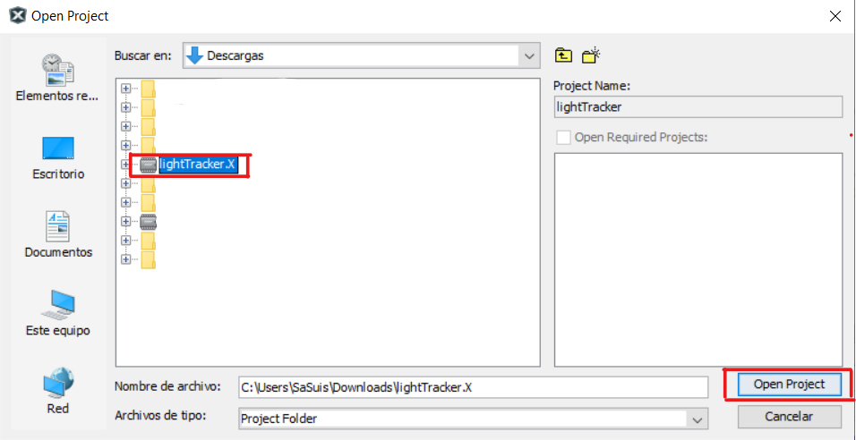
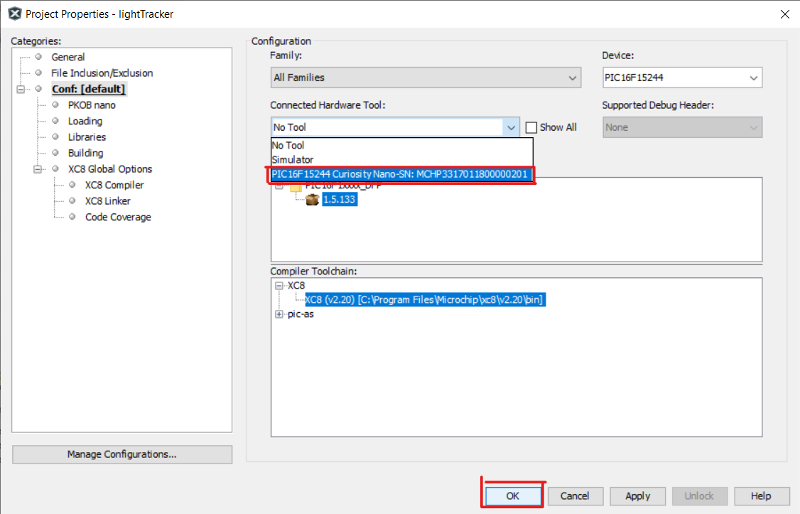
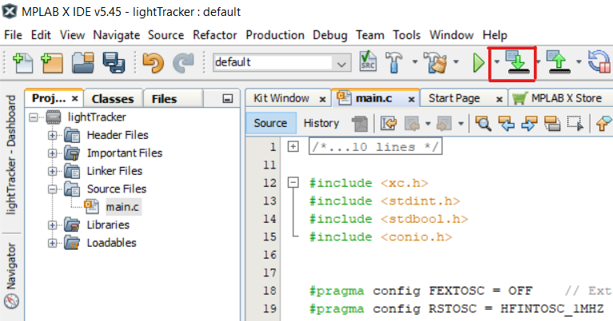
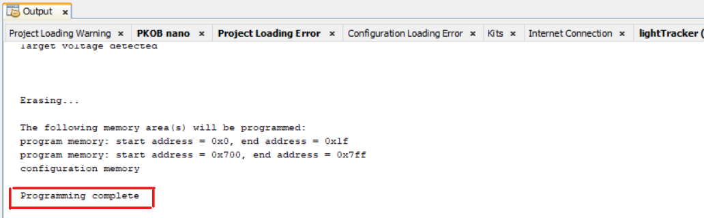

# lightTracker

This project uses the PIC16F15244 Curiosity Nano Development board for the develop and application of this project. The other materials are used for the application of this project.

## Related Documentation
- [PIC16F15244 Product Page](https://www.microchip.com/wwwproducts/en/PIC16F15244)
- [Board documentation](http://ww1.microchip.com/downloads/en/DeviceDoc/PIC16F15244-Curiosity-Nano-Hardware-User-Guide-DS50003045A.pdf)
- [Manual de usuario XC8 compiler](http://ww1.microchip.com/downloads/en/devicedoc/50002053g.pdf)
- [Fundamentals of the C Programming Language](https://microchipdeveloper.com/tls2101:start)

## Software Used
- MPLAB® X IDE 5.40 or newer [(microchip.com/mplab/mplab-x-ide)](http://www.microchip.com/mplab/mplab-x-ide)
- MPLAB® XC8 2.20 or a newer compiler [(microchip.com/mplab/compilers)](http://www.microchip.com/mplab/compilers)
- MPLAB® Code Configurator (MCC) 3.95.0 or newer [(microchip.com/mplab/mplab-code-configurator)](https://www.microchip.com/mplab/mplab-code-configurator)
- MPLAB® Code Configurator (MCC) Device Libraries PIC10 / PIC12 / PIC16 / PIC18 MCUs [(microchip.com/mplab/mplab-code-configurator)](https://www.microchip.com/mplab/mplab-code-configurator)
- Microchip PIC16F1xxxx Series Device Support (1.4.119) or newer [(packs.download.microchip.com/)](https://packs.download.microchip.com/)

## Hardware Used
- PIC16F15244 Curiosity Nano [(EV09Z19A)](https://www.microchip.com/Developmenttools/ProductDetails/EV09Z19A)
- Micro-USB to USB 2.0 cable
- DC Geared Motor 3-9V (2 uds.)
- Driver L293b
- Fotoresistor (3 uds.)
- 10K Resistor (3 uds.)
- 9V Battery

## Setup
1. Connect the PIC16f15244 Curiosity Nano board to a PC using the Micro-USB to USB 2.0 cable.
2. If not already on your system, download and install MPLABX IDE version 5.40 (or newer).
3. If not already on your system, download and install the XC8 C-Compiler version 2.20 (or newer).
4. Open the 'pic16f15244-delay-led-blink.X' project as shown in Figure 1.

###### Figure 1: Open Project Window

5. Press the 'Project Properites' button to open the Project Properties window. Select the Curiosity tool from the Tools drop-down menu as shown in Figure 2.

###### Figure 2: Select the Nano in Project Properties Window

6. Press the 'Make and Program Device' button to program the PIC (see Figure 3). Verify that the device was successfully programmed (see Figure 4).

###### Figure 3: 'Make and Program Device' Button

###### Figure 4: Program Complete

## Operation
After the Nano board is programmed, the sensors will be constantly read at the assigned inputs. The values read in the inputs will be compared and according to their combinations they will send orders to the driver that according to the orders sent will activate the geared motors.
